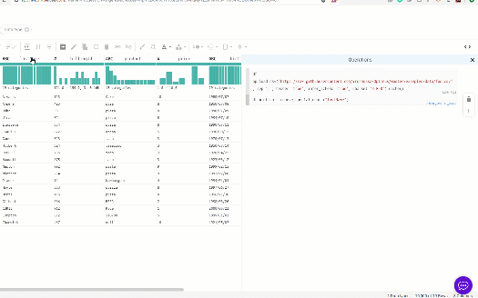
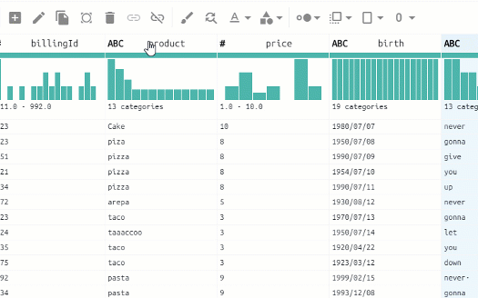
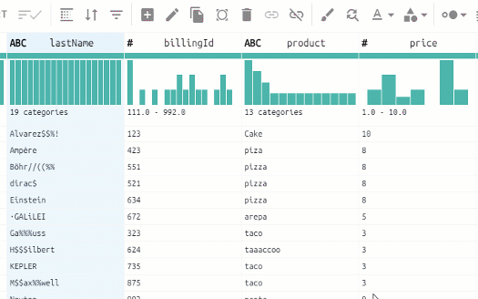

[](https://hi-bumblebee.com) 

[](http://ironmussa.com)

# Bumblebee

With Bumblebee, you can easily clean and prepare bigdata using a visual interface. It is built over Optimus so you can handle small and big data efficiently.

For more info about Bumblebee, please go to:
https://hi-bumblebee.com/

## Installation
### Docker
To run Bumblebee on a Docker container just use the following commands:

For remote servers:
```docker run --name <NAME> --network="host" -e ADDRESS=<IP> ironmussa/bumblebee:develop-3.0```

For local machines:
```docker run --name <NAME> -p 3000:3000 -p 4000:4000 -e ADDRESS=localhost ironmussa/bumblebee:develop-3.0```

You can also add ```-e SPARK=true``` to enable Spark support.

On ```<NAME>``` you can use any name you want for your environtment and on ```<IP>``` you must input the public IP address of your server. Remember to open ports 3000 and 4000 on your host.

### Ubuntu/Digital Ocean
https://medium.com/hi-bumblebee/how-to-install-bumblebee-on-digital-ocean-ef77138f1838


## Load and explore
Get data from CSV, JSON, parquet, Avro files, and databases. Then get histograms, frequency charts, and advance stats.


## Transform and Clean
Convert unstructured data, standardize strings, unify date format, Impute data, handle outliers and create custom functions.


## Prepare for Machine Learning
Bin columns, string clustering, one-hot encode, scaling, and split train and test data.


## Interact with code like in jupyter notebook
Every action over your data is added as a transformation step using python code that you can modify anytime. Also, you can add any python code you want to make complex transformations.



## See Bumblebee in action
https://www.loom.com/embed/c2cfb6a2e0a549e2afeb8d484865b968


## Contributing to Bumblebee 
Contributions go far beyond pull requests and commits. We are very happy to receive any kind of contributions including:

* Documentation updates, enhancements, designs, or bugfixes.
* Spelling or grammar fixes.
* README.md corrections or redesigns.
* Adding unit, or functional tests.
* Triaging GitHub issues -- especially determining whether an issue still persists or is reproducible.
* Searching #hibumblebee on twitter and helping someone else who needs help.
* Blogging, speaking about, or creating tutorials about Bumblebee and its many features.
