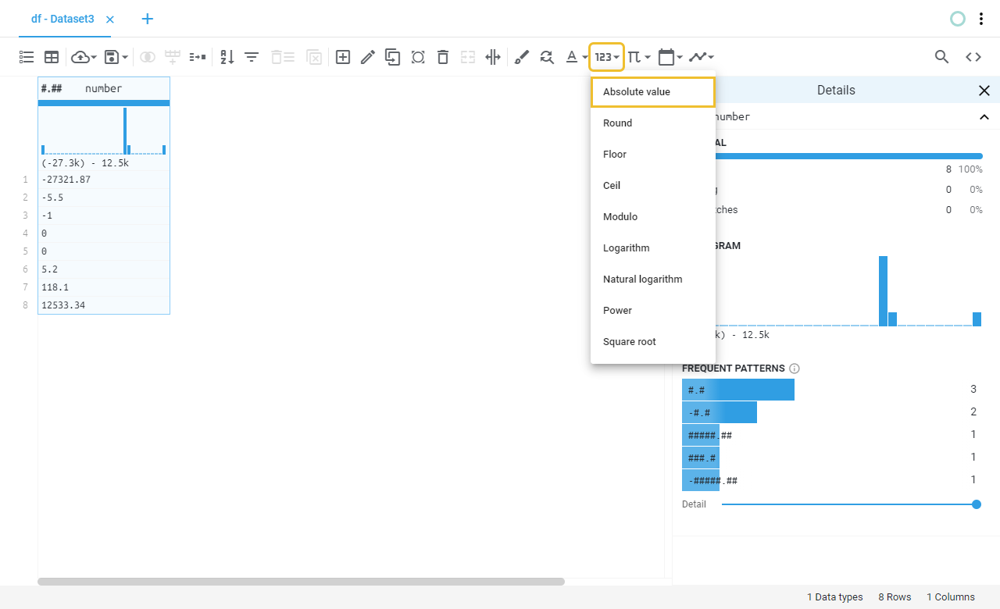

# Hi Bumblebee!
Bumblebee is the easiest, and most powerful tool to clean, transform, and prepare data of any size for Analysis, Visualization, Reporting, and Machine Learning. All in a spreadsheet-like interface.

Bumblebee can run ever multiple engines like Pandas, Dask, cuDFD, Dask-cuDF, Spark or Vaex.

The engine you decide to use will depend on the resource you have at hand.

## Some features
This is what Bumblebee can offer you.

### Clicks & Drags-and-Drops
Our spreadsheet like-interface makes the work easier for you to wrangle the data, correct wrong and duplicate values, and identify and group similar strings.

### Automated Workflows
Create cleaning repeatability by creating a “Data Recipe”.
Next time you need to clean the datasets from the same source, run your pre-saved Data Recipe, and make Bumblebee clean the data for you.

### Load data from anywhere 
Load data from CSV, JSON, Parquet, local, from a URL or from a remote storage system. Also, connect to data from databases and start working on your data wrangling in no time!

## Prerequisites
- OS Support
	- Ubuntu 18.04 LTS/20***
	- Windows 10
	- GPU Support (Dask-cuDF, cuDF)
    - Pascal or Better  
    - Compute Capability
- CUDA Support (Dask-cuDF, cuDF)
	- 10.2
- Python Support
	- 3.7
	- 3.8
