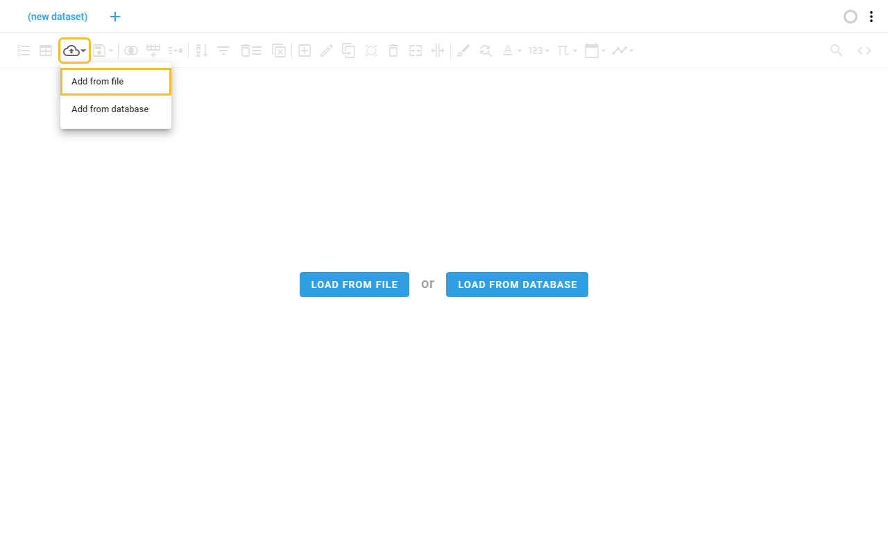
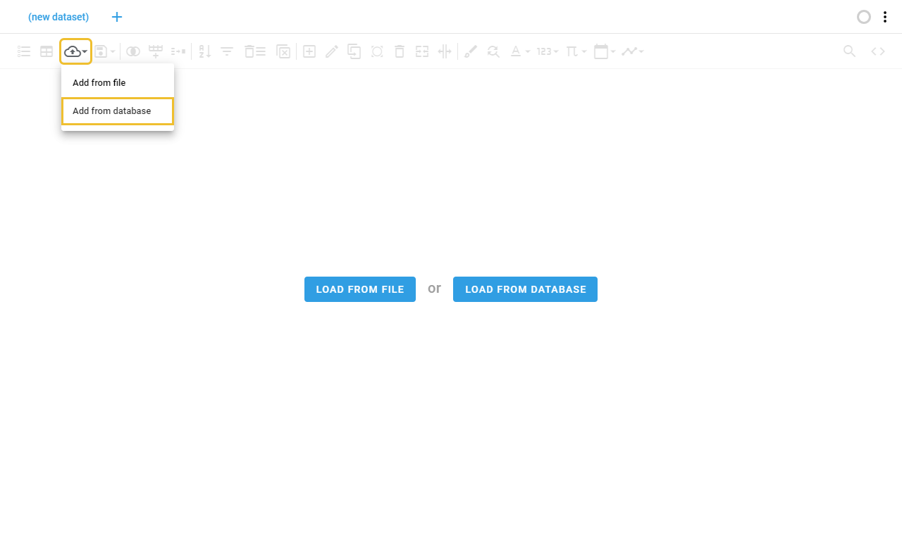

# Loading a dataset

## Loading from a file
Loads a dataset from a local or remote file. For remote files you may configure a remote connection.

## Load from database
Loads a dataset from a table stored in a database. A remote connection is required.

