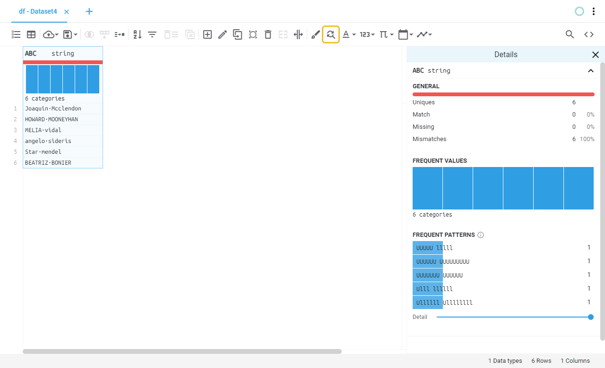
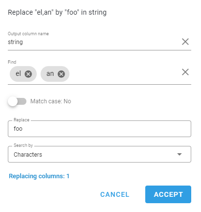
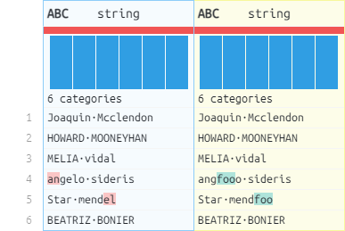

# Replace
Replaces found matches from every value of the selected columns.
## Location

## Fields
| Field | Type | Description |
| :--- | :--- | :--- |
| Find | Multiple values | Strings, words or values to search |
| Match case | Switch | Case sensitivity |
| Replace | Text field | String to replace with |
| Search by | Selection | Replace mode |
## Example

