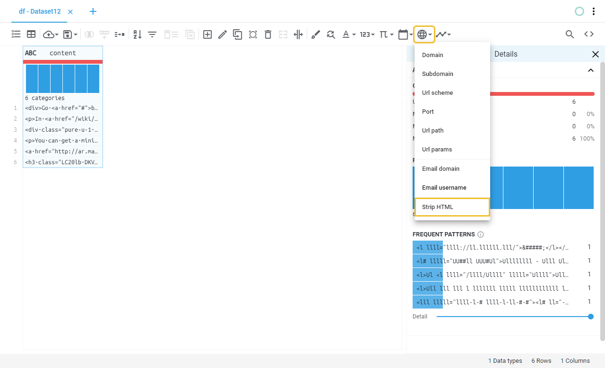
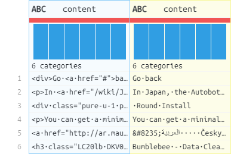

# Strip HTML
Removes HTML tags and decode HTML entities from every string value in the selected column(s).
## Location

## Fields
| Field | Type | Description |
| :--- | :--- | :--- |
| Output column name(s) | Text field | Name of the output column(s), if left blank will save the result on the same column. |
## Example
