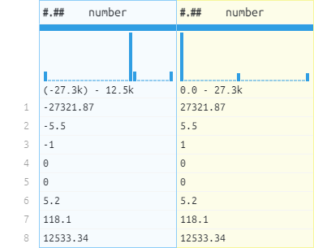

# Absolute value
Gets the transform to absolute value from the numeric values in the selected column(s).
## Location

## Fields
Field | Type | Description
----- | ---- | -----------
Output column name(s) | Text field | Name of the output column(s), if left blank will save the result on the same column.
## Example
### Preview
