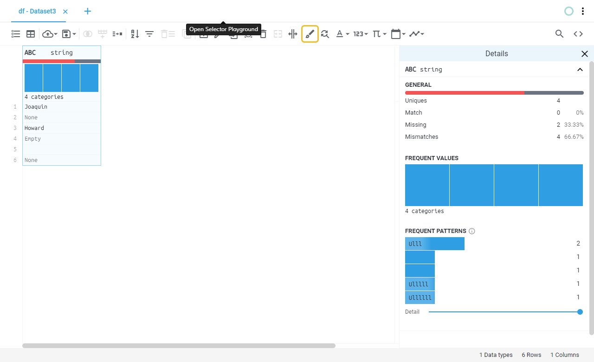
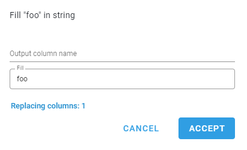
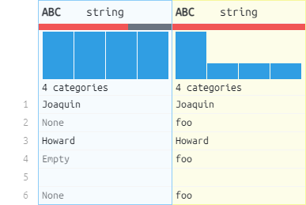

# Fill null values
Fill null values of the selected columns with a given value.
## Location

## Fields
Field | Type | Description
----- | ---- | -----------
Output column name(s) | Text field | Name of the output column(s), if left blank will save the result on the same column.
Fill | Text field | 
## Example
### Fields

### Preview
