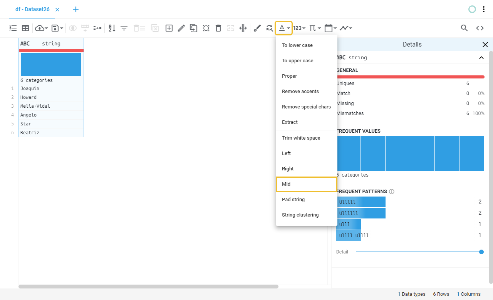

# Mid (substring)
Extracts a given number of characters from the values of a string and outputs the result to a new column or to the same input column.
This operation is useful for quickly extracting data from fixed-length values.
## Location

## Fields
Field | Type | Description
----- | ---- | -----------
Output column name(s) | Text field | Name of the output column(s), if left blank will save the result on the same column.
Start at | Numeric | 
End at | Numeric | 
## Example
### Preview
