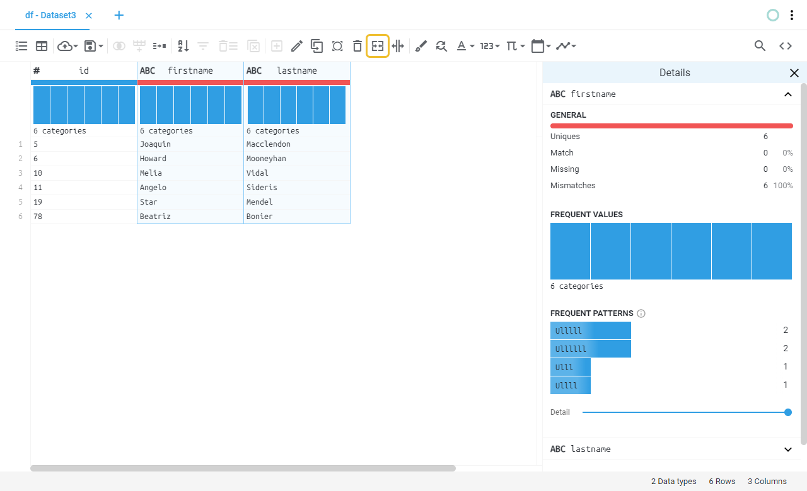
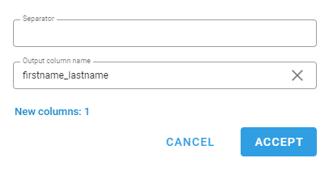
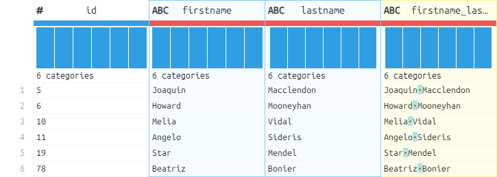

# Nest
Joins the selected columns into one column using a separator.
## Location

## Fields
| Field | Type | Description |
| :--- | :--- | :--- |
| Separator | Text field |  |
| Output column name | Text field |  |
## Example
### Fields

### Preview
