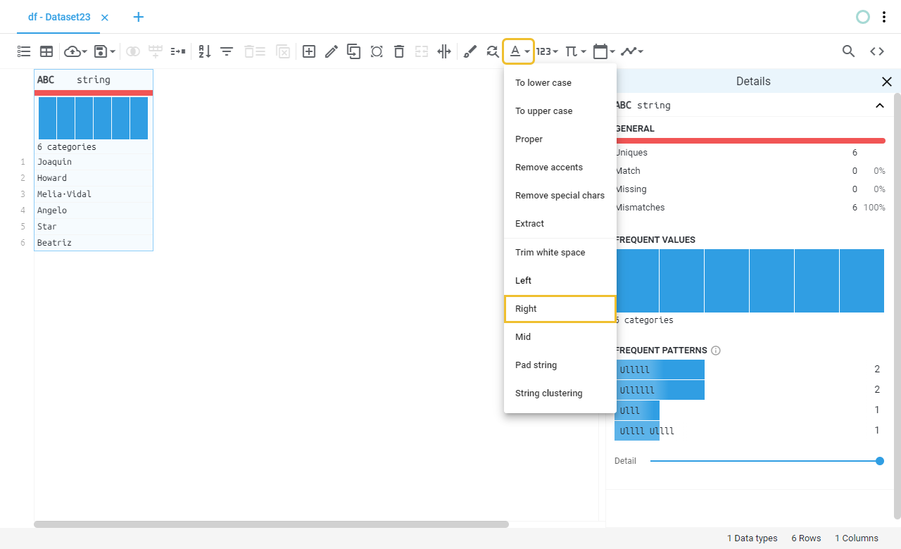
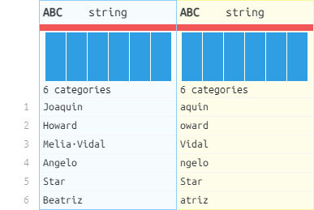

# Right (substring)
Extracts a given number of characters from the values of a string and outputs the result to a new column or to the same input column.
This operation is useful for quickly extracting data from fixed-length values.
## Location

## Fields
Field | Type | Description
----- | ---- | -----------
Output column name(s) | Text field | Name of the output column(s), if left blank will save the result on the same column.
Characters to show | Numeric | The amount of characters to be shown.
## Example
### Fields

### Preview
