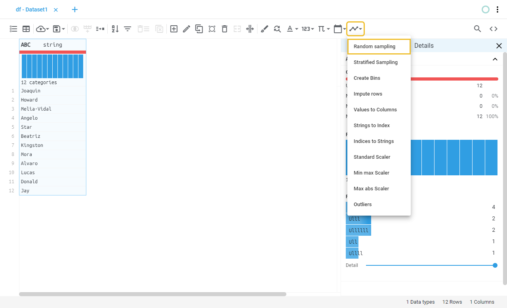
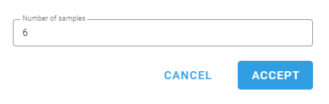
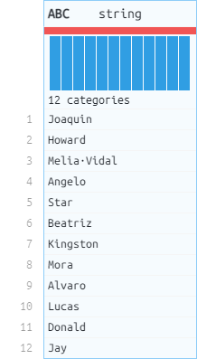

# Random sampling
Gets a random sample of the dataset.
## Location

## Fields
Field | Type | Description
----- | ---- | -----------
Number of samples | Numeric | 
## Example
### Fields

### Preview
