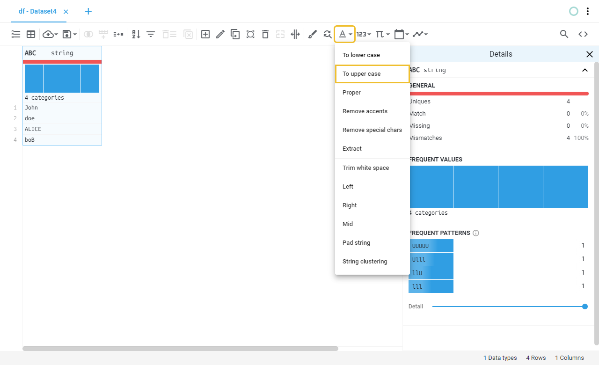
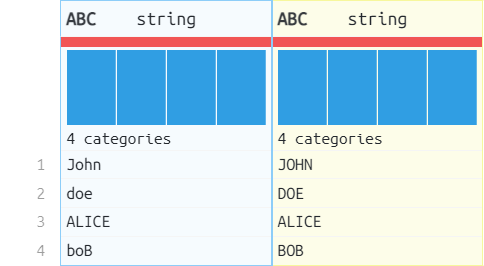

# Upper case
Converts all the alpha characters from every value of the selected columns into upper case.
## Location

## Fields
Field | Type | Description
----- | ---- | -----------
Output column name(s) | Text field | Name of the output column(s), if left blank will save the result on the same column.
## Example
### Preview
